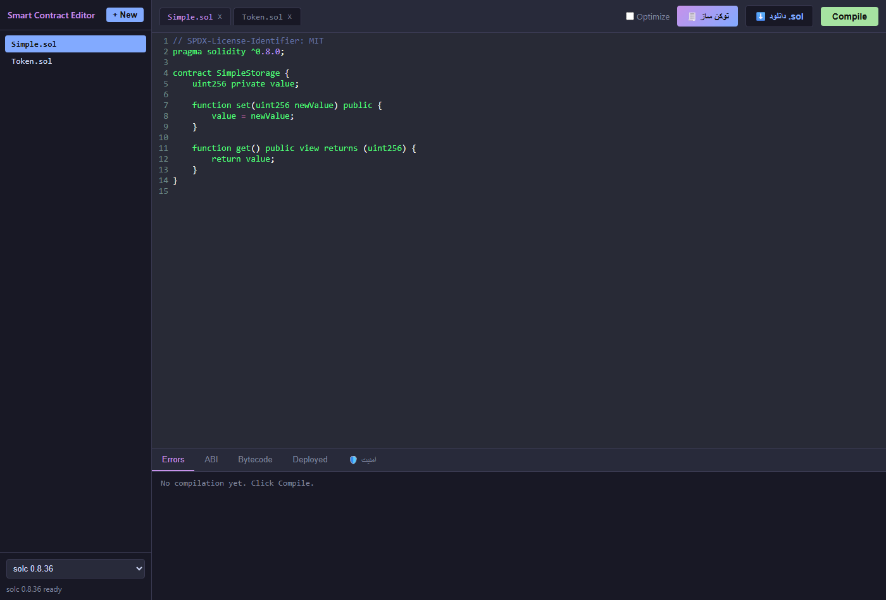

# Smart Contract Editor — ادیتور و توکن‌ساز قرارداد هوشمند

[](https://rahmatpourmba-crypto.github.io/smart-contract-editor/)
[](LICENSE)
[](https://docs.soliditylang.org)
[](https://github.com/rahmatpourmba-crypto/smart-contract-editor/pulls)

یک **IDE وب برای Solidity** (شبیه به Remix) که کاملاً در مرورگر اجرا می‌شود: ادیتور + کامپایلر + **توکن‌ساز بدون کدنویسی** + **آزمایشگاه امنیتی (Security Lab)** با اسکن استاتیک، تحلیل AST و شبیه‌سازی حمله در EVM مرورگر — بدون نصب و بدون سرور بک‌اند.

> 🔴 **نسخهٔ زنده (Demo):** [rahmatpourmba-crypto.github.io/smart-contract-editor](https://rahmatpourmba-crypto.github.io/smart-contract-editor/)
> 🧾 **صفحهٔ فروش / نمونه‌کار:** پوشهٔ [`landing/`](landing/)

---

## ✨ امکانات

### 🛡️ آزمایشگاه امنیتی (Security Lab) — ویژهٔ باگ‌یابی و آدیت
- **اسکن استاتیک (Static Scan):** ۲۰+ قانون هوشمند (Reentrancy، Access Control، Oracle/قیمت، گردکردن/دقت، Fee-on-transfer، امضا/Replay، سلیپج/MEV، DoS، فلش‌لون/Inflation، Upgradeable/initialize، Rug/تمرکز و…)
- **تحلیل AST (Expert Analyzer):** بررسی ساختار کد و قوانین منطق اقتصادی (conservation, rounding, self-balance, fee-on-transfer, buy/sell tax…)
- **شبیه‌سازی حملهٔ پویا در EVM مرورگر:** پروب‌های اکسپلویت واقعی (مثلاً برداشتِ دوبارهٔ Reentrancy با قرارداد fallback)
- **گزارش شخصی‌سازی‌شده:** لحن نوشتار (رسمی/مختصر/روایت‌محور)، نام آدیتور، یادداشت، امضا و بخش نتیجه‌گیری — پیش‌نمایش یا Markdown خام + دانلود `.md`
- **گزارش مسابقه (C4/Sherlock):** خروجی آماده برای مسابقات حسابرسی + پیش‌نویس **PoC فاوندری**
- **Attack Surface:** استخراج نقش‌ها، دارایی‌های در خطر و ورودی‌های عمومی هر قرارداد
- **چک‌لیست «برنامه حمله»** باگ‌یابی مسابقه + لینک پلتفرم‌های واقعی باگ‌باونتی (Code4rena, Sherlock, Immunefi, Cantina, CodeHawks, Hats, HackenProof)

### 🧾 توکن‌ساز (بدون کدنویسی)
- فرم مشخصات (نام/نماد/عرضه/مالک/حالت پایه یا پریمیوم) → کد آماده → کامپایل خودکار → دانلود `.sol`
- پایه: Mint, Burn, Lock, forceUnlock, transferOwnership
- پریمیوم: مالیات هر انتقال، سوزاندن خودکار، دریافت درآمد، ضد نهنگ، سقف تراکنش، مالیات خرید/فروش جداگانه، وایت‌لیست، Pausable، بلاک‌لیست، معافیت مالک/صرافی

### ⌨️ ادیتور و کامپایلر
- ادیتور Solidity با هایلایت (CodeMirror) + مدیریت چند فایل + ذخیرهٔ خودکار در `localStorage`
- کامپایلر solc در مرورگر (Web Worker) — نسخه‌ی 0.8.36 به‌صورت آفلاین محلی
- سوییچ نسخه (0.6.12 تا 0.8.36)، Optimizer، نمایش خطا/هشدار/ABI/بایت‌کد

---

## 🚀 اجرا و Demo

**Demo زنده:** [rahmatpourmba-crypto.github.io/smart-contract-editor](https://rahmatpourmba-crypto.github.io/smart-contract-editor/)

اجرای محلی:

```bash
cd smart-contract-editor
python -m http.server 8000
# یا
npx serve .
```

سپس در مرورگر: `http://localhost:8000`

> به‌خاطر ماژول‌های ES فایل را مستقیم از `file://` باز نکنید — از یک سرور محلی استفاده کنید.

---

## 📸 اسکرین‌شات

| ادیتور و توکن‌ساز | آزمایشگاه امنیتی |
|---|---|
|  |  |

(اسکرین‌شات‌ها در پوشهٔ `docs/` قرار دارند؛ نسخهٔ زنده را هم می‌توانی مستقیم ببینی.)

---

## 🏗️ ساختار

```
smart-contract-editor/
├── index.html           # ورودی اصلی (+ مودال توکن‌ساز)
├── app.js               # ادیتور، کامپایل، مدیریت فایل‌ها
├── generator.js         # توکن‌ساز (ساخت قرارداد از فرم)
├── make-token.js        # منطق تولید کد قرارداد
├── security.js          # رابط کاربری آزمایشگاه امنیتی
├── security-test.js     # موتور: اسکن استاتیک + AST + اکسپلویت EVM + گزارش‌ساز
├── evm-test.js          # اجرای رانتایم روی EVM مرورگر (تست سبز)
├── solc.worker.js       # کامپایلر در Web Worker
├── styles.css           # استایل (تم تیره)
├── contracts/           # نمونه قراردادهای فروش (MyToken, PremiumToken)
├── landing/             # صفحهٔ فروش/نمونه‌کار
├── docs/                # اسکرین‌شات و مستندات
└── solc/
    └── soljson-v0.8.36.js  # باینری solc آفلاین
```

---

## 🧪 نمونه قراردادهای فروش

در `contracts/` دو نمونه توکن استاندارد ERC-20 تست‌شده آماده است:

- **MyToken** (پایه): Mint, Burn, Lock, forceUnlock, transferOwnership — ۱۶ تست سبز
- **PremiumToken** (پریمیوم): همهٔ موارد پایه + مالیات، سوزاندن خودکار، ضد نهنگ، سقف تراکنش، مالیات خرید/فروش جدا، وایت‌لیست، Pausable، بلاک‌لیست — رانتایم سبز روی EVM مرورگر

راهنمای کامل فروش و تحویل به مشتری: [SALES.md](SALES.md) | [SALES-KIT.md](SALES-KIT.md) | [DEPLOY-GUIDE.md](DEPLOY-GUIDE.md)

---

## 🌐 English Summary

**Web3 Developer — Polygon / EVM Smart Contracts (Security First).**

- Browser-based Solidity IDE: editor, in-browser `solc` compiler (Web Worker), multi-file + `localStorage`.
- **No-code Token Factory:** generate custom ERC-20 contracts (base + premium with tax, anti-whale, maxTx, whitelist, pausable, blacklist) — auto-compile, download `.sol`.
- **Security Lab:** static rules + AST expert analyzer + dynamic exploit probes in a browser EVM + contest-ready reports (C4/Sherlock style), Foundry PoC drafts and a bug-hunting playbook.
- Ready to sell: tested sample contracts (`MyToken`, `PremiumToken`) with a sales guide ([SALES.md](SALES.md)).

---

## 📫 تماس

- GitHub: [github.com/rahmatpourmba-crypto](https://github.com/rahmatpourmba-crypto)
- ایمیل: `rahmatpourmba@gmail.com`

## 📄 مجوز

MIT
